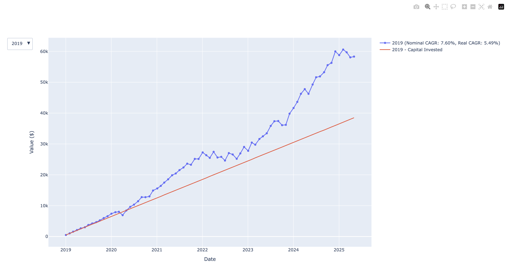
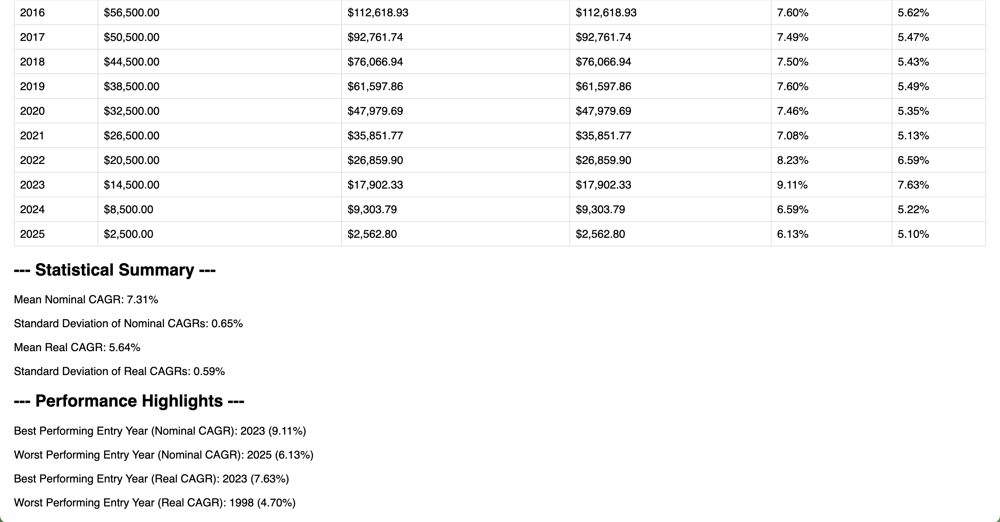

# DCA Simulation Project

This project simulates Dollar Cost Averaging (DCA) strategies for S&P 500 investments across different investor cohorts starting from various years.

## Features

- Simulates DCA investments for multiple investor cohorts (1998-2025)
- Fetches real-time S&P 500 Total Return data from Yahoo Finance
- Downloads CPI data from FRED for inflation adjustment
- Calculates both nominal and real (inflation-adjusted) returns
- Generates visualizations and statistical analysis
- Supports both online data fetching and local CSV data usage

## Setup

1. **Clone the repository and navigate to the project directory**

2. **Create a virtual environment** (recommended):
   ```bash
   python -m venv venv
   source venv/bin/activate  # On Windows: venv\Scripts\activate
   ```

3. **Install dependencies**:
   ```bash
   pip install -r requirements.txt
   ```

4. **Set up environment variables**:
   - Create a `.env` file in the project root.
   - Get a FRED API key from: https://fred.stlouisfed.org/docs/api/api_key.html
   - Add your API key to the `.env` file:
     ```
     FRED_API_KEY=your_actual_api_key_here
     ```

## Usage

To run the simulation and generate outputs:

```bash
python -m src.download_data
python -m src.process_data
python -m src.visualise_data
```

This will:
- Download S&P 500 and CPI data (if not already present in `data/`)
- Run DCA simulations for all investor cohorts
- Generate charts and statistical summaries
- Save results to `output/`

## Project Structure

```
.env
.gitignore
README.md
requirements.txt
venv/
src/
├── config.py
├── download_data.py
├── process_data.py
├── download_cpi.py
└── visualise_data.py
data/
├── cpi_data.csv
└── sp500_data.csv
output/
├── portfolio_history.json
├── simulation_results.csv
├── summary.csv
└── summary.html
```

## Output

The simulation generates:
- Summary table with performance metrics
- CAGR charts by investor start year
- Portfolio value accumulation charts
- CAGR distribution plots
- Statistical summaries and performance highlights

### Example Plot



### Summary Table Example



## Security

- API keys are stored in environment variables and never committed to the repository
- The `.env` file containing sensitive information is ignored by git
- Use the `.env.example` template to set up your own environment variables
